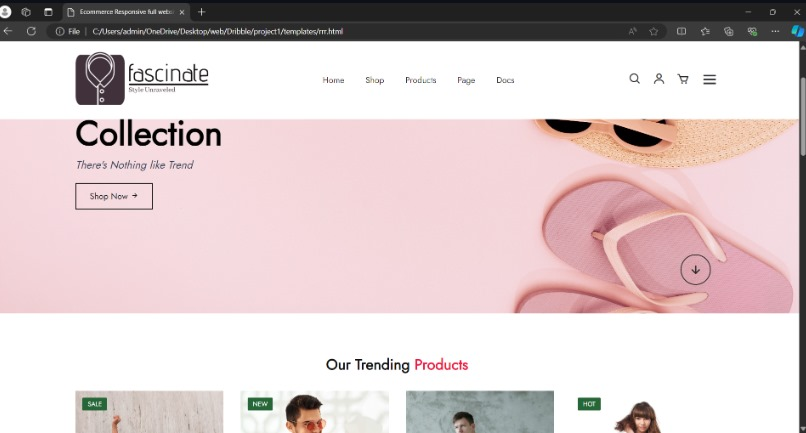

# Project Responsive Web Design using Bootstrap
## Date:31/12/2024

## AIM:
To create a simplified clone of Dribbble (https://dribbble.com/) landing page.


## DESIGN STEPS:

### Step 1:
Clone the repository from GitHub.

### Step 2:
Create Django Admin project.

### Step 3:
Create a New App under the Django Admin project.

### Step 4:
Insert the necessary CSS and JavaScript files as external in order to use Bootstrap.

### Step 5:
Create a HTML file and include the needed Bootstrap components.

### Step 6:
Publish the website in the LocalHost.

## PROGRAM :
```
dribble.html
<!DOCTYPE html>
<html lang="en">
<head>
    <meta charset="UTF-8">
    <meta http-equiv="X-UA-Compatible" content="IE=edge">
    <meta name="viewport" con
    tent="width=device-width, initial-scale=1.0">
    <title>Ecommerce Responsive full website</title>
    <!-- CSS-link -->
    <link rel="stylesheet" href="res.css">

    <link rel="preconnect" href="https://fonts.googleapis.com">
<link rel="preconnect" href="https://fonts.gstatic.com" crossorigin>
<link href="https://fonts.googleapis.com/css?family=Jost:wght@100;200;300;400;500;
600;700&display=swap" rel="stylesheet">

<link rel="stylesheet" href="https://cdnjs.cloudflare.com/ajax/libs/font-awesome/6.2.1/css/all.min.css" integrity="sha512-MV7K8+y+gLIBOVD591QIYicR65iaqukzvf/ nwasF0nqhPay5w/91JmVM2hMDcnK10nMGCdVK+iQrJ7lzPJQd1w==" crossorigin="anonymous" referrerpolicy="no-referrer" />

<link rel="stylesheet"
href="https://unpkg.com/boxicons@latest/css/boxicons.min.css">
</head>
<body>
    <header>
        <a href="#" class="logo"></a>

        <ul class="navmenu">
            <li><a href="#">home</a></li>
            <li><a href="#">shop</a></li>
            <li><a href="#">products</a></li>
            <li><a href="#">page</a></li>
            <li><a href="#">Docs</a></li>
        </ul>

        <div class="nav-icon">
            <a href="#"><i class='bx bx-search'></i></a>
            <a href="#"><i class='bx bx-user' ></i></a>
            <a href="#"><i class='bx bx-cart' ></i></a>
            
            <div class="bx bx-menu" id="menu-icon"></div>
        </div>
    </header>

    <section class="main-home">
        <div class="main-text">
        <h1><br></h1>
        <h1><br></h1>
        <h5>Winter Collection</h5>
        <h2>New Winter <br> Collection</h2> 
        <p>There's Nothing like Trend</p>
        
        <a href="#" class="main-btn">Shop Now <i class='bx bx-right-arrow-alt' ></i></a>
        </div>

        <div class="down-arrow">
            <a href="#trending" class="down"><i class='bx bx-down-arrow-alt' ></i></a>
        </div>
    </section>

        <section class="trending-product" id="trending"> 
            <div class="center-text"> 
                <h2>Our Trending <span>Products</span></h2> 
            </div>

            <div class="products">
                <div class="row">
                    
                    <div class="product-text">
                        <h5>Sale</h5>
                    </div>
                    <div class="heart-icon">
                    <i class='bx bx-heart'></i>
                    </div>
                    <div class="ratting">
                        <i class='bx bx-star'></i>
                        <i class='bx bx-star'></i>
                        <i class='bx bx-star'></i>
                        <i class='bx bx-star'></i>
                        <i class='bx bxs-star-half' ></i>
                    </div>
                    
                    <div class="price"> 
                        <h4>Half Running Set</h4> 
                        <p>$99-$129</p>
                    </div>
                </div>
                

                <div class="row">
                    
                    <div class="product-text">
                        <h5>New</h5>
                    </div>
                    <div class="heart-icon">
                    <i class='bx bx-heart'></i>
                    </div>
                    <div class="ratting">
                        <i class='bx bx-star'></i>
                        <i class='bx bx-star'></i>
                        <i class='bx bx-star'></i>
                        <i class='bx bx-star'></i>
                        <i class='bx bxs-star-half' ></i>
                    </div>
                    
                    <div class="price"> 
                        <h4>Coat-suits</h4> 
                        <p>$99-$129</p>
                    </div>
                </div>

                <div class="row">
                    
         
                    <div class="heart-icon">
                    <i class='bx bx-heart'></i>
                    </div>
                    <div class="ratting">
                        <i class='bx bx-star'></i>
                        <i class='bx bx-star'></i>
                        <i class='bx bx-star'></i>
                        <i class='bx bx-star'></i>
                        <i class='bx bxs-star-half' ></i>
                    </div>
                    
                    <div class="price"> 
                        <h4>Half Running Suit</h4> 
                        <p>$99-$129</p>
                    </div>
                </div>

                <div class="row">
                    
                    <div class="product-text">
                        <h5>Hot</h5>
                    </div>
                    <div class="heart-icon">
                    <i class='bx bx-heart'></i>
                    </div>
                    <div class="ratting">
                        <i class='bx bx-star'></i>
                        <i class='bx bx-star'></i>
                        <i class='bx bx-star'></i>
                        <i class='bx bx-star'></i>
                        <i class='bx bxs-star-half' ></i>
                    </div>
                    
                    <div class="price"> 
                        <h4>Half Fancy Lady Dress</h4> 
                        <p>$99-$129</p>
                    </div>
                </div>

                <div class="row">
                    

                    <div class="heart-icon">
                    <i class='bx bx-heart'></i>
                    </div>
                    <div class="ratting">
                        <i class='bx bx-star'></i>
                        <i class='bx bx-star'></i>
                        <i class='bx bx-star'></i>
                        <i class='bx bx-star'></i>
                        <i class='bx bxs-star-half' ></i>
                    </div>
                    
                    <div class="price"> 
                        <h4>Flix Flox Jeans</h4> 
                        <p>$99-$129</p>
                    </div>
                </div>

                <div class="row">
                    
                    <div class="product-text">
                        <h5>Hot</h5>
                    </div>
                    <div class="heart-icon">
                    <i class='bx bx-heart'></i>
                    </div>
                    <div class="ratting">
                        <i class='bx bx-star'></i>
                        <i class='bx bx-star'></i>
                        <i class='bx bx-star'></i>
                        <i class='bx bx-star'></i>
                        <i class='bx bxs-star-half' ></i>
                    </div>
                    
                    <div class="price"> 
                        <h4>Fancy Salwar Suit</h4> 
                        <p>$99-$129</p>
                    </div>
                </div>

                <div class="row">
                    
                    <div class="product-text">
                        <h5>Sale</h5>
                    </div>
                    <div class="heart-icon">
                    <i class='bx bx-heart'></i>
                    </div>
                    <div class="ratting">
                        <i class='bx bx-star'></i>
                        <i class='bx bx-star'></i>
                        <i class='bx bx-star'></i>
                        <i class='bx bx-star'></i>
                        <i class='bx bxs-star-half' ></i>
                    </div>
                    
                    <div class="price"> 
                        <h4>Printed Straight Kurta</h4> 
                        <p>$99-$129</p>
                    </div>
                </div>

                <div class="row">
                    
                    <div class="product-text">
                        <h5>Sale</h5>
                    </div>
                    <div class="heart-icon">
                    <i class='bx bx-heart'></i>
                    </div>
                    <div class="ratting">
                        <i class='bx bx-star'></i>
                        <i class='bx bx-star'></i>
                        <i class='bx bx-star'></i>
                        <i class='bx bx-star'></i>
                        <i class='bx bxs-star-half' ></i>
                    </div>
                    
                    <div class="price"> 
                        <h4>Casuals</h4> 
                        <p>$99-$129</p>
            </div>

        </section>

        <section class="client-reviews">
            <div class="reviews">
                <h3>Client Reviews</h3>
                
                <p>Facsinate has become my go-to brand for timeless elegance. From their impeccably tailored blazers to their buttery-soft leather accessories, every piece feels like an investment in style. The attention to detail—subtle stitching, hidden pockets, and exquisite linings—sets them apart. Whether I’m dressing for a boardroom meeting or a weekend brunch, LuxeCo effortlessly bridges sophistication and comfort. Plus, their sustainable practices make me feel good about my choices. Five stars from this satisfied shopper</p>
                
                <h2>Mark Jevenue</h2>
                <p>CEO of Addle</p>
            </div>
        </section>

    <section class="Update-news">
        <div class="up-center-text">
            <h2>New Updates</h2>
        </div>

        <div class="update-cart">
            <div class="cart">
                
                <h5>26 jan 2022</h5>
                <h4>Let's Start bring sale on this summer vacation.</h4>
                <p>Lorem ipsum dolor sit amet, consectetur adipiscing elit, sed do eiusmod tempor incididunt ut labore et dolore magna aliqua. Ut enim ad minim veniam, quis</p>
                
                <h6><b>Continue Reading..</b></h6>
            </div>

            <div class="cart">
                
                <h5>26 jan 2022</h5>
                <h4>Let's Start bring sale on this summer vacation.</h4>
                <p>Lorem ipsum dolor sit amet, consectetur adipiscing elit, sed do eiusmod tempor incididunt ut labore et dolore magna aliqua. Ut enim ad minim veniam, quis</p>
                
                <h6><b>Continue Reading..</b></h6>
            </div>

            <div class="cart">
                
                <h5>26 jan 2022</h5>
                <h4>Let's Start bring sale on this summer vacation.</h4>
                <p>Lorem ipsum dolor sit amet, consectetur adipiscing elit, sed do eiusmod tempor incididunt ut labore et dolore magna aliqua. Ut enim ad minim veniam, quis</p>
                
                <h6><b>Continue Reading..</b></h6>
            </div>
        </div>
    </section>

    <!-- contact-section -->
<section class="contact">
    <div class="contact-info">
        <div class="first-info">
            
            <p>3245 Grant Street Longview, <br> TX united kingdom 765378</p>
            <p>01601348732</p>
            <p>saidulahmed3080@gmail.com</p>
           
            <div class="social-icon">
                <a href="#"><i class='bx bxl-facebook'></i></a>
                <a href="#"><i class='bx bxl-twitter' ></i></a>
                <a href="#"><i class='bx bxl-instagram' ></i></a>
                <a href="#"><i class='bx bxl-youtube' ></i></a>
                <a href="#"><i class='bx bxl-linkedin' ></i></a>
            </div>
        </div>
            <div class="second-info">
                <h4>Support</h4>
                <p>Contact us</p>
                <p>About page</p>
                <p>Size Guide</p>
                <p>Shopping & Resturns</p>
                <p>Privacy</p>
        </div>

        <div class="third-info">
            <h4>Shop</h4>
            <p>Men's Shopping</p>
            <p>Women's Shopping</p>
            <p>Kids's Shopping</p>
            <p>Furniture</p>
            <p>Discount</p>
        </div>

        <div class="fourth-info">
            <h4>Company</h4>
            <p>About</p>
            <p>Blog</p>
            <p>Affiliate</p>
            <p>Login</p>
        </div>

        <div class="five">
            <h4>Subscribe</h4>
            <p>Receive Updates, Hot Deals, Discounts Sent Straight In Your Inbox
            Daily</p>
            <p>Lorem Ipsum Dolor Sit Amet Consectetur Adipisicing Elit. Eum,
            Debitis.</p>
            <p>Receive Updates, Hot Deals, Discounts Sent Straight In Your Inbox
            Daily</p>
        </div>
    </div>
    </section>

    <div class="end-text" >
        <p>Copyright © @2024. All Rights Reserved.</p>
    </div>
    
    <script src="res.js"></script>

</body>
</html>

res.css

*{
    margin: 0;
    padding: 0;
    box-sizing: border-box;
    scroll-behavior: smooth;
    font-family: 'Jost', sans-serif;
    list-style: none;
    text-decoration: none;
}
header{
    position: fixed;
    width: 100%;
    top: 0;
    right: 0;
    z-index: 1000;
    display: flex;
    align-items: center;
    justify-content: space-between;
    padding: 20px 10%;
}
.logo img{
    max-width: 250px;
    height: auto;
}
.navmenu{
    display: flex;
}
.navmenu{
display: flex;
}
.navmenu a{
    color: #2c2c2c;
    font-size: 16px;
    text-transform: capitalize;
    padding: 10px 20px;
    font-weight: 400;
    transition: all .42s ease;
}
 .navmenu a:hover{
    color: #ee1c47;
}
.nav-icon{
    display: flex;
    align-items: center;
}
.nav-icon i{
    margin-right: 20px;
    color: #2c2c2c;
    font-size: 25px;
    font-weight: 400;
    transition: all .42s ease;
}
.nav-icon i:hover{
    transform: scale(1.1);
    color: #EE1C47;
}
#menu-icon{
    font-size: 35px;
    color: #2c2c2c;
    z-index: 10001;
    cursor: pointer;
}

section{
padding: 5% 10%;
}

.main-home{
    width: 100%;
    height: 100vh;
    background-image: url(./composition-pink-beach-objects.jpg);
    background-position: center;
    background-size: cover;
    display: grid;
    grid-template-columns: repeat(1, 1fr);
    align-items: center;
}
.main-text h5{
    color: #EE1C47;
    font-size: 16px;
    text-transform: capitalize;
    font-weight: 500;
}
.main-text h2{
    color: #000;
    font-size: 65px;
    text-transform: capitalize;
    line-height: 1.1;
    font-weight: 600;
    margin: 6px 0 10px;
}
.main-text p{
color: #333c56;
font-size: 20px;
font-style: italic;
margin-bottom: 20px;
}
.main-btn{
    display: inline-block;
    color: #111;
    font-size: 16px;
    font-weight: 500;
    text-transform: capitalize;
    border: 2px solid #111;
    padding: 12px 25px;
    transition: all .42s ease;
}
    .main-btn:hover{
    background-color: #000;
    color: #fff;
}
.down-arrow{
    position: absolute;
    top: 85%;
    right: 11%;
}
.down i{
    font-size: 30px;
    color: #2c2c2c;
    border: 2px solid #2c2c2c;
    border-radius: 50px;
    padding: 12px 12px;
}
.down i:hover{
    background-color: #2c2c2c;
    color: #fff;
    transition: all .42s ease;
} 
header.sticky{
    background:#fff;
    padding: 20px 10%;
    box-shadow: 0px 0px 10px rgb(000/10%);
}
.center-text h2{
    color: #111;
    font-size: 28px;
    text-transform: capitalize;
    text-align: center;
    margin-bottom: 30px;
}
.center-text span{
    color: #EE1C47;
}
.products{
    display: grid;
    grid-template-columns: repeat(auto-fit, minmax(260px, auto));
    gap: 2rem;
}
.row{
    position: relative;
    transition: all .40s;
}
.row img{
    width: 100%;
    height: auto;
    transition: all .40s;
}
.row img:hover {
    transform: scale(0.9);
    }
.product-text h5{
    position: absolute;
    top: 13px;
    left: 13px;
    color: #fff;
    font-size: 12px;
    font-weight: 500;
    text-transform: uppercase;
    background-color:#276737;
    padding: 3px 10px;
    border-radius: 2px;
}.heart-icon{
    position: absolute;
    right: 0;
    font-size: 20px;
}
.heart-icon:hover{
    color: #EE1C47;
    }
    .ratting i{
    color: #FF8C00;
    font-size: 18px;
    }
.price h4{
    color: #111;
    font-size: 16px;
    text-transform: capitalize;
    font-weight: 400;
}
.price p{
color: #151515;
font-size: 14px;
font-weight: 600;
}
.client-reviews{
    background-color: #f3f4f6;
}
.reviews{
    text-align: center;
}

.reviews h3{
    color: #111;
    font-size: 25px;
    text-transform: capitalize;
    text-align: center;
    font-weight: 700;
}
.reviews img{
    width: 100px;
    height: auto;
    border-radius: 50px;
    margin: 10px 0;
}
.reviews p{
    color: #707070;
    font-size: 16px;
    font-weight: 400;
    line-height: 25px;
    margin-bottom: 10px;
}
.reviews h2{
    font-size: 22px;
    color: #000;
    font-weight: 400;
    text-transform: capitalize;
    margin-bottom: 2px;
}

.up-center-text h2{
    text-align: center;
    color:#111;
    font-size: 25px;
    text-transform: capitalize;
    font-weight: 700;
    margin-bottom: 30px;
}
.cart img{
    width: 380px;
    height: auto;
    border-radius: 5px;
}
.update-cart{
    display: grid;
    grid-template-columns: repeat(auto-fit, minmax(380px, auto));
    gap: 1rem;
}
.cart h5{
    color: #636872;
    font-size: 14px;
    text-transform: capitalize;
    font-weight: 500;
}
.cart h4{
    color: #111;
    font-size: 18px;
    font-weight: 600;
}
.cart p{
    color: #707070;
    font-size: 15px;
    max-width: 380px;
    line-height: 25px;
    margin-bottom: 12px;
}
.cart h6{
    color: #151515;
    font-size: 14px;
    font-weight: 500;
}
.contact{
    background-color: #f3f4f6;
}
.contact-info{
    display: grid;
    grid-template-columns: repeat(auto-fit, minmax(160px, auto));
    gap: 3rem;
}
.first-info img{
    width: 180px;
    height: auto;
} 
.contact-info h4{
    color: #212529;
    font-size: 14px;
    text-transform: uppercase;
    margin-bottom: 10px;
}
.contact-info p{
    color: #565656;
    font-size: 14px;
    font-weight: 400;
    text-transform: capitalize;
    line-height: 1.5;
    margin-bottom: 10px;
    cursor: pointer;
    transition: all .42s;
}
.contact-info{
    color: #ee1c47;
}
.social-icon i{
    color: #565656;
    margin-right: 10px;
    font-size: 20px;
    transition: all .425;
}
.social-icon i:hover{
    transform: scale(1.3);
}
.end-text{
    background-color:#edfff1;
    text-align: center;
    padding: 20px;
}
.end-text p{
    color: #111;
    text-transform: capitalize;
}
@media(max-width :890px) {
    header{
        padding: 20px 3%;
        transition: .4s;
    }
}


dri.js

// Select the elements
const menuIcon = document.getElementById('menu-icon');
const navMenu = document.querySelector('.navmenu');
const header = document.querySelector('header');

// Function to toggle the menu visibility
function toggleMenu() {
    navMenu.classList.toggle('show');
}

// Add click event listener to the menu icon
menuIcon.addEventListener('click', toggleMenu);

// Add scroll event listener to make header sticky
window.addEventListener('scroll', function() {
    header.classList.toggle('sticky', window.scrollY > 0);
});
```
## OUTPUT:


## RESULT:
The Project for responsive web design using Bootstrap is completed successfully.
